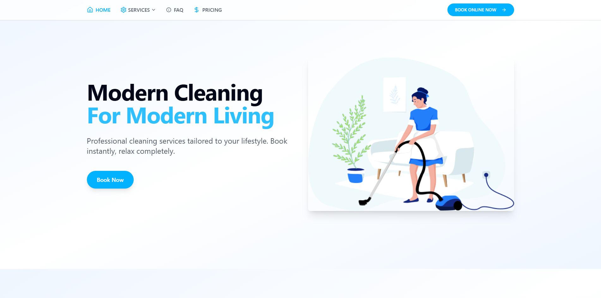

# Modern Cleaning Service Website



A professional website for a cleaning service company built with modern web technologies.

## 🚀 Tech Stack

- **Frontend Framework**: React 18 with TypeScript
- **Build Tool**: Vite
- **Styling**: Tailwind CSS
- **UI Components**: shadcn/ui
- **State Management**: React Query
- **Routing**: React Router DOM
- **Form Handling**: React Hook Form
- **Data Validation**: Zod
- **Icons**: Lucide React
- **Charts**: Recharts
- **Toast Notifications**: Sonner
- **Date Handling**: date-fns

## 🛠️ Quick Start

### Prerequisites

- Node.js 16.x or later
- npm 7.x or later

### Installation

1. Clone the repository:
```bash
git clone <your-repo-url>
```

2. Navigate to the project directory:
```bash
cd cleaning-service-website
```

3. Install dependencies:
```bash
npm install
```

4. Start the development server:
```bash
npm run dev
```

The application will be available at `http://localhost:8080`

## 📦 Build for Production

```bash
npm run build
```

The built files will be in the `dist` directory.

## 🎯 Key Features

- Responsive design for all devices
- Modern UI with smooth animations
- Service booking system
- FAQ section
- Pricing calculator
- Contact form
- Testimonials
- Service showcase

## 🔧 Project Structure

```
src/
├── components/     # Reusable UI components
├── pages/         # Page components
├── hooks/         # Custom React hooks
├── utils/         # Utility functions
├── types/         # TypeScript type definitions
└── lib/           # Third-party library configurations
```

## 🎨 Design System

The project uses a consistent design system with:
- Custom color palette
- Typography scale
- Spacing system
- Component variants

All styling is handled through Tailwind CSS classes with custom configuration.

## 🔐 Best Practices

- TypeScript for type safety
- Component-based architecture
- Responsive design patterns
- Accessibility standards (WCAG)
- SEO optimization
- Performance optimization

## 📱 Browser Support

- Chrome (latest)
- Firefox (latest)
- Safari (latest)
- Edge (latest)

## 📝 Development Commands

```bash
npm run dev        # Start development server
npm run build      # Build for production
npm run preview    # Preview production build
npm run lint       # Run ESLint
```

## 🤝 Contributing

1. Fork the repository
2. Create your feature branch (`git checkout -b feature/AmazingFeature`)
3. Commit your changes (`git commit -m 'Add some AmazingFeature'`)
4. Push to the branch (`git push origin feature/AmazingFeature`)
5. Open a Pull Request

## 📄 License & Copyright

© 2024 All Rights Reserved.

This project and its source code are protected by copyright law. All rights are reserved. 
No part of this software may be reproduced, distributed, or transmitted in any form or by any means without explicit written permission.

For licensing inquiries and purchase options, please contact:
Email: robbygrey1993@gmail.com
